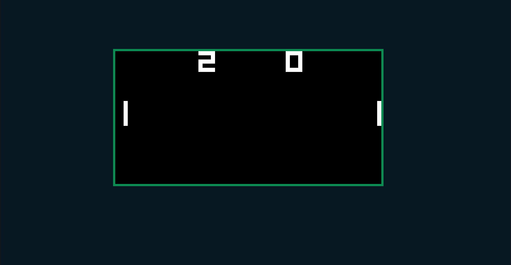
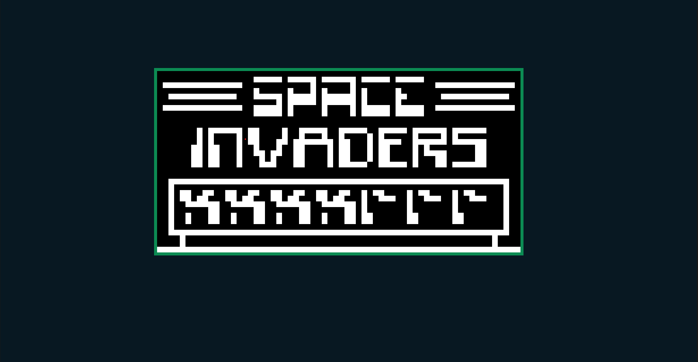
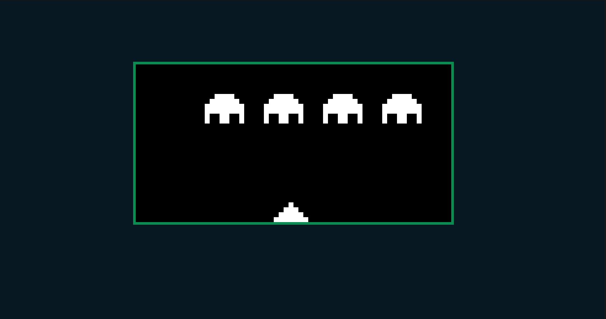

# chip8

A chip8 implementation in JavaScript.

## What is it?

The first baby-steps noobiest project in developing emulators. After this we are cooking with gas now, I'll tell you that.

<cite>
Chip-8 is a simple, interpreted, programming language which was first used on some do-it-yourself computer systems in the late 1970s and early 1980s. The COSMAC VIP, DREAM 6800, and ETI 660 computers are a few examples. These computers typically were designed to use a television as a display, had between 1 and 4K of RAM, and used a 16-key hexadecimal keypad for input. The interpreter took up only 512 bytes of memory, and programs, which were entered into the computer in hexadecimal, were even smaller.
</cite>

## Screenshots

<small>A working pong game</small>

---

<small>Space Invaders start screen</small>

---

<small>A working pong game</small>

## Todo:

- [ ] Sound Bug
- [ ] Debugging Support
- [ ] Option to choose roms

## References:

- http://devernay.free.fr/hacks/chip8/C8TECH10.HTM
- https://en.wikipedia.org/wiki/CHIP-8
